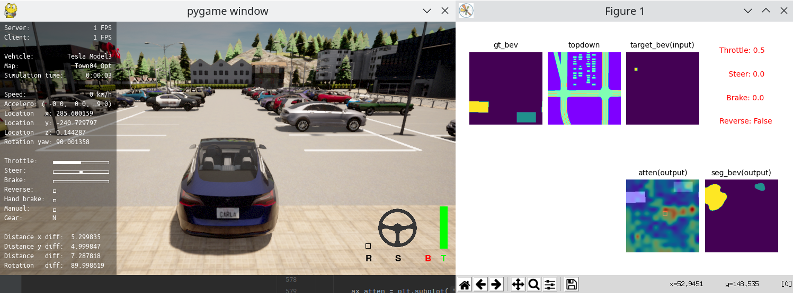
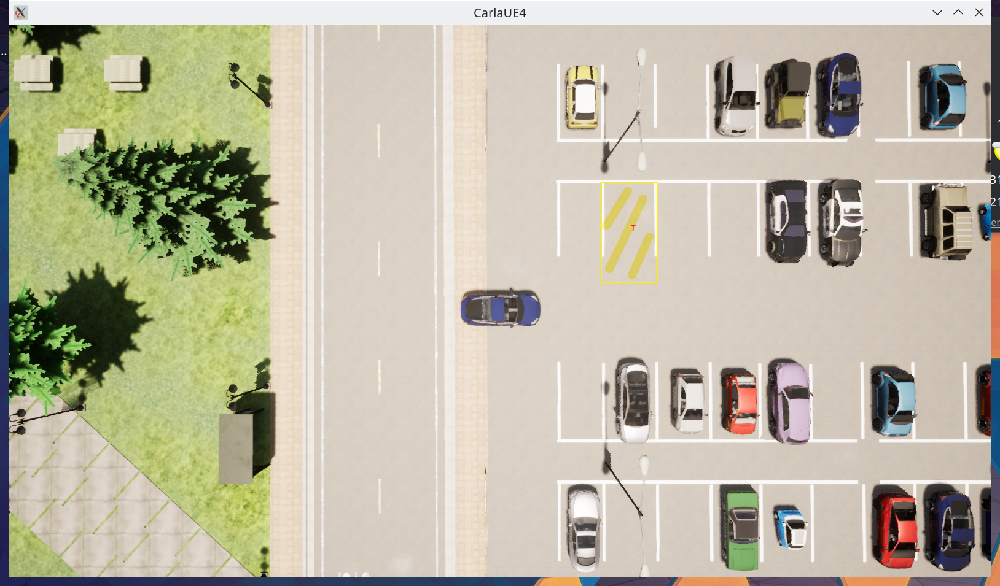

start carla
```Shell
./carla/CarlaUE4.sh -opengl -RenderOffScreen
```

evaluate and collect data using 4 camera:
```Shell
python3 carla_parking_eva_e2e.py
```
evaluate and collect data using 6 camera:
```Shell
python3 carla_parking_eva.py
```

train using 6 camera dataset:
```shell
python pl_train.py
```

# axis
## carla
## conet

